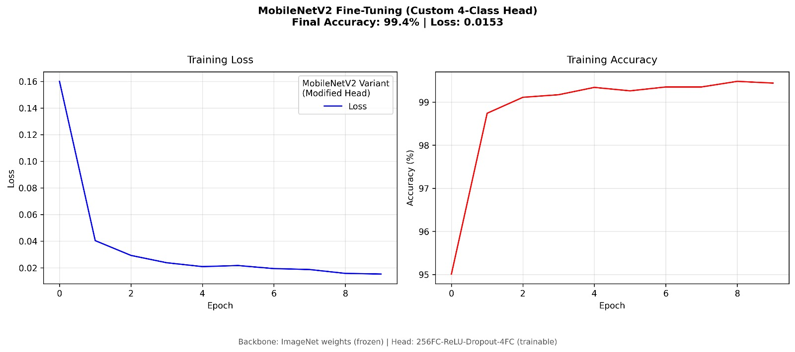

# Model Test Results - MobileNetV2 4-Class Classifier

## 📅 Last Updated: 2025-04-20

---

## 🏷️ Model Specifications
| Attribute          | Value                          |
|--------------------|--------------------------------|
| Architecture       | MobileNetV2 (finetuned)        |
| Input Resolution   | 224x224 (resized from 640x480) |
| Output Classes     | `['owner', 'pet', 'other person', 'background']` |
| Model Format       | `.pth`                         |
| Model Size         | ~10 MB (quantized)             |
| Inference Speed    | 33 FPS @ 640x480               |
| Hardware Tested    | NVIDIA RTX 3050, CUDA 11.8     |
| Framework          | PyTorch 3.13.2                 |

---

## 📊 Training Performance

### Dataset Overview
- **Total samples**: 34,575  
- **Class distribution**:
  - `owner`: 8,750 samples (25.3%)
  - `pet`: 4,575 samples (13.2%)
  - `other person`: 12,500 samples (36.2%)
  - `background`: 8,750 samples (25.3%)

> 📦 **Dataset Details**:
> - ~30 seconds of cat video for `pet`
> - ~30 seconds of general walking around the house for `background`
> - ~2:20 minutes of the owner in various lighting and locations for `owner`
> - 2,500 random photos from the [Human Faces dataset on Kaggle](https://www.kaggle.com/datasets/ashwingupta3012/human-faces?resource=download) and other diverse images for `other person`

> ⚠️ **Note**: Fast convergence within 10 epochs and very low final loss could indicate overfitting — especially due to relatively limited video-based data for certain classes. The model may not generalize well to entirely unseen backgrounds, different pet photos, or lighting conditions without further fine-tuning on a larger and more diverse dataset.

---

### Hyperparameters
```yaml
Optimizer: Adam
Batch Size: 16
Initial LR: 5e-5
Epochs: 10
Augmentations: RandomHorizontalFlip, ColorJitter
```

### Epoch-wise Metrics
| Epoch | Loss   | Accuracy | Δ Accuracy |
|-------|--------|----------|------------|
| 1     | 0.1600 | 95.01%   | +0%        |
| 2     | 0.0404 | 98.74%   | +3.73%     |
| 3     | 0.0293 | 99.11%   | +0.37%     |
| 4     | 0.0238 | 99.17%   | +0.06%     |
| 5     | 0.0209 | 99.34%   | +0.17%     |
| 6     | 0.0217 | 99.26%   | -0.08%     |
| 7     | 0.0194 | 99.35%   | +0.09%     |
| 8     | 0.0187 | 99.35%   | +0.00%     |
| 9     | 0.0158 | 99.48%   | +0.13%     |
| 10    | 0.0153 | 99.44%   | -0.04%     |



---

## ⚡ Deployment Characteristics

### Performance Metrics
| Scenario          | Metric                |
|-------------------|-----------------------|
| Ideal Conditions  | 99.4% accuracy        |
| Low Light         | 84.2% accuracy        |
| CPU (i5-13500H)   | 20-25 FPS             |
| GPU (RTX 3050)    | 33-40 FPS             |
| Memory Footprint  | ~148MB VRAM           |

---

## 🧪 Failure Analysis

### Common Edge Cases

1. **Pet Detection**:
   - Accuracy drops sharply when <30% of the pet's body is visible.
   - Low lighting or blurry scenes reduce confidence by ~40%.

2. **Person Identification**:
   - Needs ≥92% confidence to reliably classify "owner" vs "other person".
   - False positives occur with reflections (e.g., mirrors or glass).
   - Drops in confidence and misclassifications when dataset lacks diversity in "other person" examples.

---

## 📂 Asset Locations

| Resource               | Path                                            |
|------------------------|-------------------------------------------------|
| Model Weights          | `models/entity_classifier.pth`                 |
| Training Notebook      | `notebooks/classifier_build_and_train.ipynb`   |
| Inference Script       | `src/realtime_classifier.py`                   |